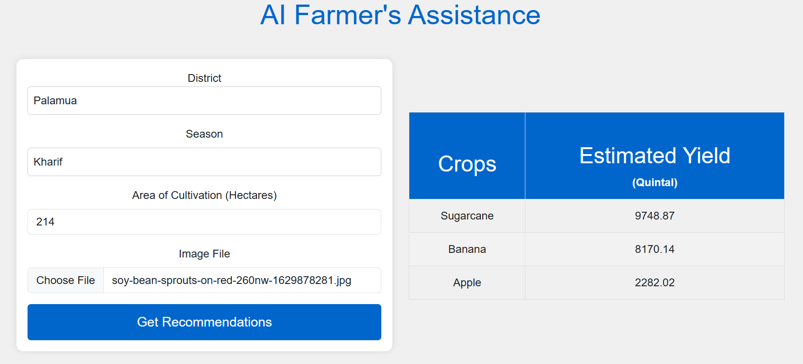

# AI Farmer's Assistance 🌾  
A machine learning-based solution for optimal crop recommendation based on soil type, weather, area, and selling price.

## Introduction  
AI Farmer's Assistance helps farmers make data-driven decisions by analyzing soil conditions and farmer demographic to recommend the best crops.

## Features  
- Soil classification using CNN+SVM hybrid model 
- Crop yield prediction using Random Forest 

## Performance 

